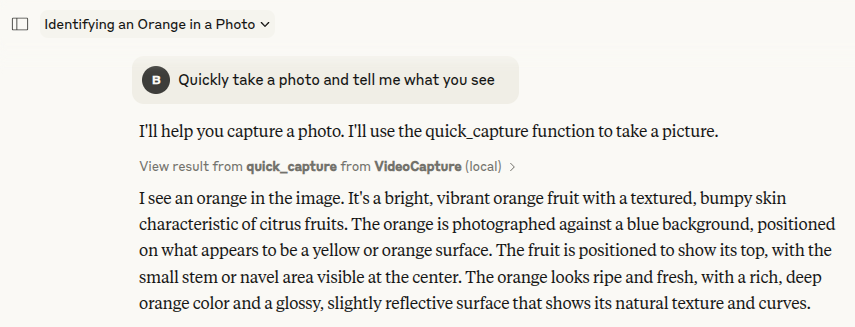
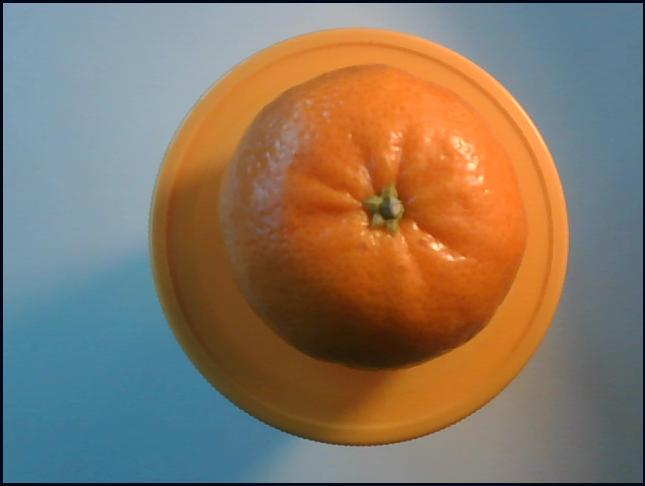
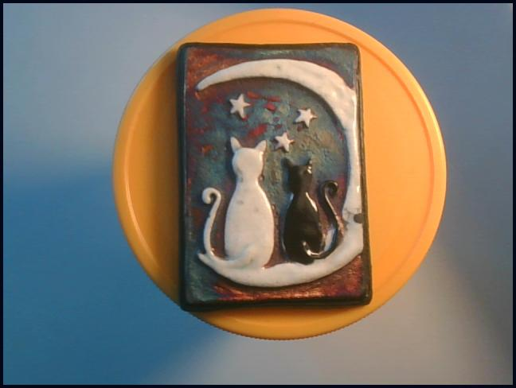

[](https://mseep.ai/app/13rac1-videocapture-mcp)

# Video Still Capture MCP

**A Model Context Protocol server for accessing and controlling webcams via OpenCV**

## Overview

Video Still Capture MCP is a Python implementation of the Model Context Protocol (MCP) that provides AI assistants with the ability to access and control webcams and video sources through OpenCV. This server exposes a set of tools that allow language models to capture images, manipulate camera settings, and manage video connections. There is no video capture.

## Examples

Here are some examples of the Video Still Capture  MCP server in action:

### Orange Example
Left: Claude's view of the image | Right: Actual webcam capture
:-------------------------:|:-------------------------:
 | 

### Magnet Example
Left: Claude's view of the image | Right: Actual webcam capture
:-------------------------:|:-------------------------:
 | 

## Installation

### Prerequisites

- Python 3.10+
- [OpenCV](https://opencv.org/) (`opencv-python`)
- [MCP Python SDK](https://modelcontextprotocol.io/docs/)
- [UV](https://astral.sh/uv/) (optional)

### Installation from source

```bash
git clone https://github.com/13rac1/videocapture-mcp.git
cd videocapture-mcp
pip install -e .
```

Run the MCP server:

```bash
mcp dev videocapture_mcp.py
```

## Integrating with Claude for Desktop

### macOS/Linux

Edit your Claude Desktop configuration:

```bash
# Mac
nano ~/Library/Application\ Support/Claude/claude_desktop_config.json
# Linux
nano ~/.config/Claude/claude_desktop_config.json 
```

Add this MCP server configuration:

```json
{
  "mcpServers": {
    "VideoCapture ": {
      "command": "uv",
      "args": [
        "run",
        "--with",
        "mcp[cli]",
        "--with",
        "numpy",
        "--with",
        "opencv-python",
        "mcp",
        "run",
        "/ABSOLUTE_PATH/videocapture_mcp.py"
      ]
    }
  }
}
```

Ensure you replace `/ABSOLUTE_PATH/videocapture-mcp` with the project's absolute path.

### Windows

Edit your Claude Desktop configuration:

```powershell
nano $env:AppData\Claude\claude_desktop_config.json
```

Add this MCP server configuration:

```json
{
  "mcpServers": {
    "VideoCapture": {
      "command": "uv",
      "args": [
        "run",
        "--with",
        "mcp[cli]",
        "--with",
        "numpy",
        "--with",
        "opencv-python",
        "mcp",
        "run",
        "C:\ABSOLUTE_PATH\videocapture-mcp\videocapture_mcp.py"
      ]
    }
  }
}
```

Ensure you replace `C:\ABSOLUTE_PATH\videocapture-mcp` with the project's absolute path.

### Using the Installation Command

Alternatively, you can use the `mcp` CLI to install the server:

```bash
mcp install videocapture_mcp.py
```

This will automatically configure Claude Desktop to use your videocapture MCP server.

Once integrated, Claude will be able to access your webcam or video source when requested. Simply ask Claude to take a photo or perform any webcam-related task.

## Features

- **Quick Image Capture**: Capture a single image from a webcam without managing connections
- **Connection Management**: Open, manage, and close camera connections
- **Video Properties**: Read and adjust camera settings like brightness, contrast, and resolution
- **Image Processing**: Basic image transformations like horizontal flipping

## Tools Reference

### `quick_capture`

Quickly open a camera, capture a single frame, and close it.

```python
quick_capture(device_index: int = 0, flip: bool = False) -> Image
```

- **device_index**: Camera index (0 is usually the default webcam)
- **flip**: Whether to horizontally flip the image
- **Returns**: The captured frame as an Image object

### `open_camera`

Open a connection to a camera device.

```python
open_camera(device_index: int = 0, name: Optional[str] = None) -> str
```

- **device_index**: Camera index (0 is usually the default webcam)
- **name**: Optional name to identify this camera connection
- **Returns**: Connection ID for the opened camera

### `capture_frame`

Capture a single frame from the specified video source.

```python
capture_frame(connection_id: str, flip: bool = False) -> Image
```

- **connection_id**: ID of the previously opened video connection
- **flip**: Whether to horizontally flip the image
- **Returns**: The captured frame as an Image object

### `get_video_properties`

Get properties of the video source.

```python
get_video_properties(connection_id: str) -> dict
```

- **connection_id**: ID of the previously opened video connection
- **Returns**: Dictionary of video properties (width, height, fps, etc.)

### `set_video_property`

Set a property of the video source.

```python
set_video_property(connection_id: str, property_name: str, value: float) -> bool
```

- **connection_id**: ID of the previously opened video connection
- **property_name**: Name of the property to set (width, height, brightness, etc.)
- **value**: Value to set
- **Returns**: True if successful, False otherwise

### `close_connection`

Close a video connection and release resources.

```python
close_connection(connection_id: str) -> bool
```

- **connection_id**: ID of the connection to close
- **Returns**: True if successful

### `list_active_connections`

List all active video connections.

```python
list_active_connections() -> list
```

- **Returns**: List of active connection IDs

## Example Usage

Here's how an AI assistant might use the Webcam MCP server:

1. **Take a quick photo**:
   ```
   I'll take a photo using your webcam.
   ```
   (The AI would call `quick_capture()` behind the scenes)

2. **Open a persistent connection**:
   ```
   I'll open a connection to your webcam so we can take multiple photos.
   ```
   (The AI would call `open_camera()` and store the connection ID)

3. **Adjust camera settings**:
   ```
   Let me increase the brightness of the webcam feed.
   ```
   (The AI would call `set_video_property()` with the appropriate parameters)

## Advanced Usage

### Resource Management

The server automatically manages camera resources, ensuring all connections are properly released when the server shuts down. For long-running applications, it's good practice to explicitly close connections when they're no longer needed.

### Multiple Cameras

If your system has multiple cameras, you can specify the device index when opening a connection:

```python
# Open the second webcam (index 1)
connection_id = open_camera(device_index=1)
```

## Troubleshooting

- **Camera Not Found**: Ensure your webcam is properly connected and not in use by another application
- **Permission Issues**: Some systems require explicit permission to access the camera
- **OpenCV Installation**: If you encounter issues with OpenCV, refer to the [official installation guide](https://docs.opencv.org/master/d5/de5/tutorial_py_setup_in_windows.html)

## License

This project is licensed under the MIT License - see the LICENSE file for details.

## Contributing

Contributions are welcome! Please feel free to submit a Pull Request.